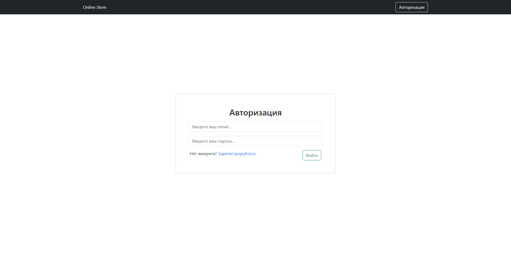
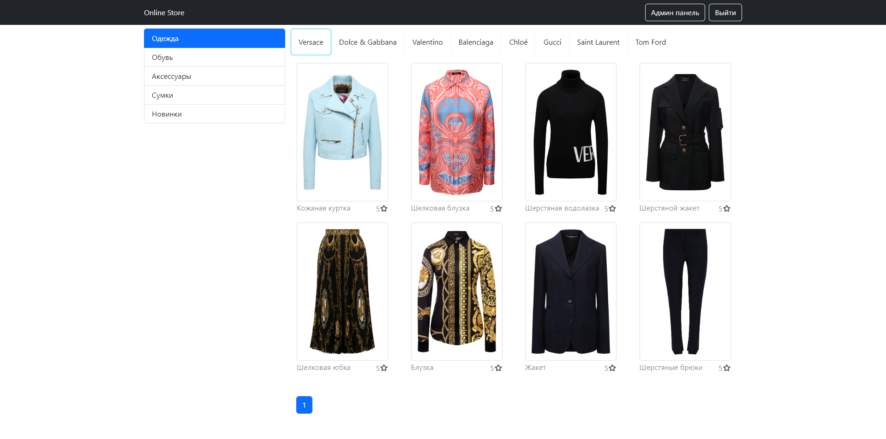
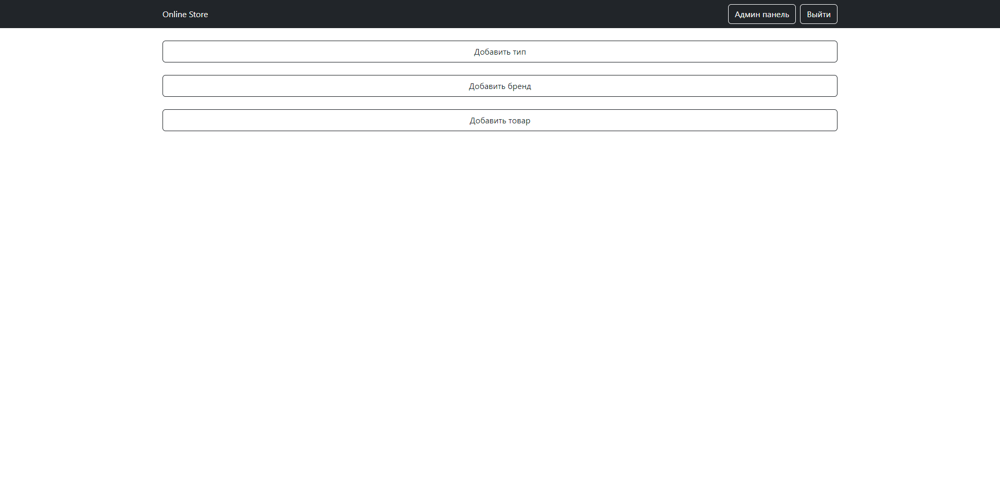
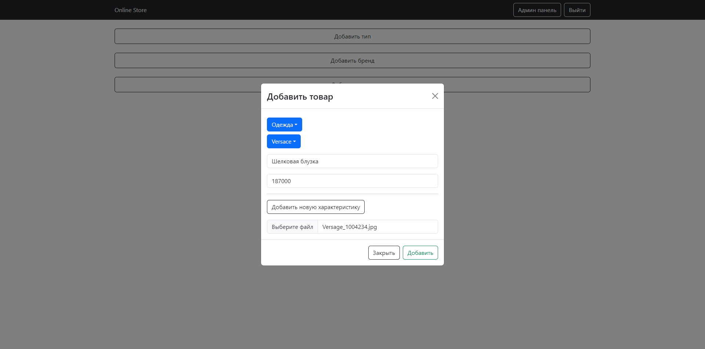
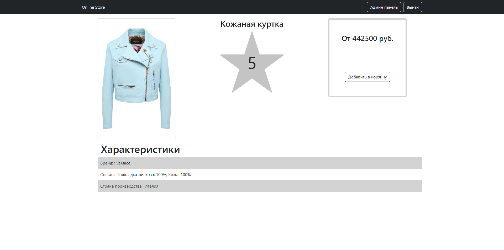

## Fullstack интернет магазин

- ### В проекте реализована серверная и клиентская часть
- ### В проекте реализована маршрутизация, обработка запросов от клиента на стороне сервера, подключена база данных postgreSQL и описаны модели таблиц, добавлена регистрация по ролям (user, admin), авторизация по jwt токену, работа с состоянием на стороне клиента, создана админ панель с возможностью администратору добавлять новые категории, бренды, товары, характеристики в том числе и в бд
- ### Технологии - `react`, `bootstrap`, `express`, `mobx`, `postgresql`, `sequelize`, `axios`, `jsonwebtoken`, `react-router-dom`

